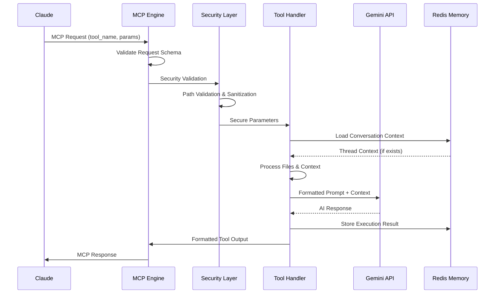

# Data Flow & Processing Patterns

## Overview

The Gemini MCP Server implements sophisticated data flow patterns that enable secure, efficient, and contextually-aware AI collaboration. This document traces data movement through the system with concrete examples and performance considerations.

## Primary Data Flow Patterns

### 1. Standard Tool Execution Flow



**Example Request Flow**:
```json
// Claude → MCP Engine
{
  "method": "tools/call",
  "params": {
    "name": "analyze",
    "arguments": {
      "files": ["/workspace/tools/analyze.py"],
      "question": "Explain the architecture pattern",
      "continuation_id": "550e8400-e29b-41d4-a716-446655440000"
    }
  }
}
```

### 2. File Processing Pipeline

#### Stage 1: Security Validation (`utils/file_utils.py:67`)

```python
# Input: ["/workspace/tools/analyze.py", "../../../etc/passwd"]
def validate_file_paths(file_paths: List[str]) -> List[str]:
    validated = []
    for path in file_paths:
        # 1. Dangerous pattern detection
        if any(danger in path for danger in ['../', '~/', '/etc/', '/var/']):
            logger.warning(f"Blocked dangerous path: {path}")
            continue
            
        # 2. Absolute path requirement
        if not os.path.isabs(path):
            path = os.path.abspath(path)
            
        # 3. Sandbox boundary check
        if not path.startswith(PROJECT_ROOT):
            logger.warning(f"Path outside sandbox: {path}")
            continue
            
        validated.append(path)
    
    return validated
# Output: ["/workspace/tools/analyze.py"]
```

#### Stage 2: Docker Path Translation (`utils/file_utils.py:89`)

```python
# Host Environment: /Users/user/project/tools/analyze.py
# Container Environment: /workspace/tools/analyze.py
def translate_paths_for_environment(paths: List[str]) -> List[str]:
    translated = []
    for path in paths:
        if WORKSPACE_ROOT and path.startswith(WORKSPACE_ROOT):
            container_path = path.replace(WORKSPACE_ROOT, '/workspace', 1)
            translated.append(container_path)
        else:
            translated.append(path)
    return translated
```

#### Stage 3: Priority-Based Processing (`utils/file_utils.py:134`)

```python
# File Priority Matrix
FILE_PRIORITIES = {
    '.py': 1,     # Source code (highest priority)
    '.js': 1,     '.ts': 1,     '.tsx': 1,
    '.md': 2,     # Documentation
    '.json': 2,   '.yaml': 2,   '.yml': 2,
    '.txt': 3,    # Text files
    '.log': 4,    # Logs (lowest priority)
}

# Token Budget Allocation
def allocate_token_budget(files: List[str], total_budget: int) -> Dict[str, int]:
    # Priority 1 files get 60% of budget
    # Priority 2 files get 30% of budget  
    # Priority 3+ files get 10% of budget
    
    priority_groups = defaultdict(list)
    for file in files:
        ext = Path(file).suffix.lower()
        priority = FILE_PRIORITIES.get(ext, 4)
        priority_groups[priority].append(file)
    
    allocations = {}
    if priority_groups[1]:  # Source code files
        code_budget = int(total_budget * 0.6)
        per_file = code_budget // len(priority_groups[1])
        for file in priority_groups[1]:
            allocations[file] = per_file
            
    if priority_groups[2]:  # Documentation files
        doc_budget = int(total_budget * 0.3)
        per_file = doc_budget // len(priority_groups[2])
        for file in priority_groups[2]:
            allocations[file] = per_file
    
    return allocations
```

#### Stage 4: Content Processing & Formatting

```python
def process_file_content(file_path: str, token_limit: int) -> str:
    try:
        with open(file_path, 'r', encoding='utf-8') as f:
            content = f.read()
        
        # Token estimation (rough: 1 token ≈ 4 characters)
        estimated_tokens = len(content) // 4
        
        if estimated_tokens > token_limit:
            # Smart truncation preserving structure
            lines = content.split('\n')
            truncated_lines = []
            current_tokens = 0
            
            for line in lines:
                line_tokens = len(line) // 4
                if current_tokens + line_tokens > token_limit:
                    break
                truncated_lines.append(line)
                current_tokens += line_tokens
            
            content = '\n'.join(truncated_lines)
            content += f"\n\n... [Truncated at {token_limit} tokens]"
        
        # Format with line numbers for precise references
        lines = content.split('\n')
        formatted_lines = []
        for i, line in enumerate(lines, 1):
            formatted_lines.append(f"{i:6d}\t{line}")
        
        return '\n'.join(formatted_lines)
        
    except Exception as e:
        return f"Error reading {file_path}: {str(e)}"
```

### 3. Conversation Memory Flow

#### Context Storage Pattern (`utils/conversation_memory.py:78`)

```python
# Tool execution creates persistent context
async def store_tool_execution(thread_id: str, tool_execution: ToolExecution):
    context = await self.retrieve_thread(thread_id) or ThreadContext(thread_id)
    
    # Add new execution to history
    context.tool_history.append(tool_execution)
    
    # Update file set (deduplication)
    if tool_execution.files:
        context.conversation_files.update(tool_execution.files)
    
    # Update token tracking
    context.context_tokens += tool_execution.response_tokens
    context.last_accessed = datetime.now()
    
    # Persist to Redis
    await self.redis.setex(
        f"thread:{thread_id}",
        timedelta(hours=24),  # 24-hour expiration
        context.to_json()
    )
```

#### Context Retrieval & Reconstruction

```python
async def build_conversation_context(thread_id: str) -> str:
    context = await self.retrieve_thread(thread_id)
    if not context:
        return ""
    
    # Build conversation summary
    summary_parts = []
    
    # Add file context (deduplicated)
    if context.conversation_files:
        summary_parts.append("## Previous Files Analyzed:")
        for file_path in sorted(context.conversation_files):
            summary_parts.append(f"- {file_path}")
    
    # Add tool execution history
    if context.tool_history:
        summary_parts.append("\n## Previous Analysis:")
        for execution in context.tool_history[-3:]:  # Last 3 executions
            summary_parts.append(f"**{execution.tool_name}**: {execution.summary}")
    
    return '\n'.join(summary_parts)
```

### 4. Thinking Mode Processing

#### Dynamic Token Allocation (`tools/models.py:67`)

```python
# Thinking mode determines computational budget
THINKING_MODE_TOKENS = {
    'minimal': 128,    # Quick answers, simple questions
    'low': 2048,      # Basic analysis, straightforward tasks
    'medium': 8192,   # Standard analysis, moderate complexity
    'high': 16384,    # Deep analysis, complex problems
    'max': 32768      # Maximum depth, critical decisions
}

def prepare_gemini_request(prompt: str, thinking_mode: str, files: List[str]) -> dict:
    # Calculate total context budget
    thinking_tokens = THINKING_MODE_TOKENS.get(thinking_mode, 8192)
    file_tokens = MAX_CONTEXT_TOKENS - thinking_tokens - 1000  # Reserve for response
    
    # Process files within budget
    file_content = process_files_with_budget(files, file_tokens)
    
    # Construct final prompt
    full_prompt = f"""
{prompt}

## Available Context ({thinking_tokens} thinking tokens allocated)

{file_content}

Please analyze using {thinking_mode} thinking mode.
"""
    
    return {
        'prompt': full_prompt,
        'max_tokens': thinking_tokens,
        'temperature': 0.2 if thinking_mode in ['high', 'max'] else 0.5
    }
```

## Advanced Data Flow Patterns

### 1. Cross-Tool Continuation Flow

```python
# Tool A (analyze) creates foundation
analyze_result = await analyze_tool.execute({
    'files': ['/workspace/tools/'],
    'question': 'What is the architecture pattern?'
})

# Store context with continuation capability
thread_id = str(uuid.uuid4())
await memory.store_tool_execution(thread_id, ToolExecution(
    tool_name='analyze',
    files=['/workspace/tools/'],
    summary='Identified MCP plugin architecture pattern',
    continuation_id=thread_id
))

# Tool B (thinkdeep) continues analysis
thinkdeep_result = await thinkdeep_tool.execute({
    'current_analysis': analyze_result.content,
    'focus_areas': ['scalability', 'security'],
    'continuation_id': thread_id  # Links to previous context
})
```

### 2. Error Recovery & Graceful Degradation

```python
def resilient_file_processing(files: List[str]) -> str:
    """Process files with graceful error handling"""
    results = []
    
    for file_path in files:
        try:
            content = read_file_safely(file_path)
            results.append(f"=== {file_path} ===\n{content}")
        except PermissionError:
            results.append(f"=== {file_path} ===\nERROR: Permission denied")
        except FileNotFoundError:
            results.append(f"=== {file_path} ===\nERROR: File not found")
        except UnicodeDecodeError:
            # Try binary file detection
            try:
                with open(file_path, 'rb') as f:
                    header = f.read(16)
                    if is_binary_file(header):
                        results.append(f"=== {file_path} ===\nBinary file (skipped)")
                    else:
                        results.append(f"=== {file_path} ===\nERROR: Encoding issue")
            except:
                results.append(f"=== {file_path} ===\nERROR: Unreadable file")
        except Exception as e:
            results.append(f"=== {file_path} ===\nERROR: {str(e)}")
    
    return '\n\n'.join(results)
```

### 3. Performance Optimization Patterns

#### Concurrent File Processing

```python
async def process_files_concurrently(files: List[str], token_budget: int) -> str:
    """Process multiple files concurrently with shared budget"""
    
    # Allocate budget per file
    allocations = allocate_token_budget(files, token_budget)
    
    # Create processing tasks
    tasks = []
    for file_path in files:
        task = asyncio.create_task(
            process_single_file(file_path, allocations.get(file_path, 1000))
        )
        tasks.append(task)
    
    # Wait for all files to complete
    results = await asyncio.gather(*tasks, return_exceptions=True)
    
    # Combine results, handling exceptions
    processed_content = []
    for i, result in enumerate(results):
        if isinstance(result, Exception):
            processed_content.append(f"Error processing {files[i]}: {result}")
        else:
            processed_content.append(result)
    
    return '\n\n'.join(processed_content)
```

#### Intelligent Caching

```python
class FileContentCache:
    def __init__(self, max_size: int = 100):
        self.cache = {}
        self.access_times = {}
        self.max_size = max_size
    
    async def get_file_content(self, file_path: str, token_limit: int) -> str:
        # Create cache key including token limit
        cache_key = f"{file_path}:{token_limit}"
        
        # Check cache hit
        if cache_key in self.cache:
            self.access_times[cache_key] = time.time()
            return self.cache[cache_key]
        
        # Process file and cache result
        content = await process_file_content(file_path, token_limit)
        
        # Evict oldest entries if cache full
        if len(self.cache) >= self.max_size:
            oldest_key = min(self.access_times.keys(), 
                           key=lambda k: self.access_times[k])
            del self.cache[oldest_key]
            del self.access_times[oldest_key]
        
        # Store in cache
        self.cache[cache_key] = content
        self.access_times[cache_key] = time.time()
        
        return content
```

## Data Persistence Patterns

### 1. Redis Thread Storage

```python
# Thread context serialization
class ThreadContext:
    def to_json(self) -> str:
        return json.dumps({
            'thread_id': self.thread_id,
            'tool_history': [ex.to_dict() for ex in self.tool_history],
            'conversation_files': list(self.conversation_files),
            'context_tokens': self.context_tokens,
            'created_at': self.created_at.isoformat(),
            'last_accessed': self.last_accessed.isoformat()
        })
    
    @classmethod
    def from_json(cls, json_str: str) -> 'ThreadContext':
        data = json.loads(json_str)
        context = cls(data['thread_id'])
        context.tool_history = [
            ToolExecution.from_dict(ex) for ex in data['tool_history']
        ]
        context.conversation_files = set(data['conversation_files'])
        context.context_tokens = data['context_tokens']
        context.created_at = datetime.fromisoformat(data['created_at'])
        context.last_accessed = datetime.fromisoformat(data['last_accessed'])
        return context
```

### 2. Configuration State Management

```python
# Environment-based configuration with validation
class Config:
    def __init__(self):
        self.gemini_api_key = self._require_env('GEMINI_API_KEY')
        self.gemini_model = os.getenv('GEMINI_MODEL', 'gemini-2.0-flash-thinking-exp')
        self.project_root = os.getenv('PROJECT_ROOT', '/workspace')
        self.redis_url = os.getenv('REDIS_URL', 'redis://localhost:6379')
        self.max_context_tokens = int(os.getenv('MAX_CONTEXT_TOKENS', '1000000'))
        
        # Validate critical paths
        if not os.path.exists(self.project_root):
            raise ConfigError(f"PROJECT_ROOT does not exist: {self.project_root}")
    
    def _require_env(self, key: str) -> str:
        value = os.getenv(key)
        if not value:
            raise ConfigError(f"Required environment variable not set: {key}")
        return value
```

## Security Data Flow

### 1. Request Sanitization Pipeline

```python
def sanitize_request_data(request: dict) -> dict:
    """Multi-layer request sanitization"""
    sanitized = {}
    
    # 1. Schema validation
    validated_data = RequestSchema.parse_obj(request)
    
    # 2. Path sanitization
    if 'files' in validated_data:
        sanitized['files'] = [
            sanitize_file_path(path) for path in validated_data['files']
        ]
    
    # 3. Content filtering
    if 'prompt' in validated_data:
        sanitized['prompt'] = filter_sensitive_content(validated_data['prompt'])
    
    # 4. Parameter validation
    for key, value in validated_data.items():
        if key not in ['files', 'prompt']:
            sanitized[key] = validate_parameter(key, value)
    
    return sanitized
```

### 2. Response Sanitization

```python
def sanitize_response_data(response: str) -> str:
    """Remove sensitive information from responses"""
    
    # Remove potential API keys, tokens, passwords
    sensitive_patterns = [
        r'api[_-]?key["\s:=]+[a-zA-Z0-9-_]{20,}',
        r'token["\s:=]+[a-zA-Z0-9-_]{20,}',
        r'password["\s:=]+\S+',
        r'/home/[^/\s]+',  # User paths
        r'[a-zA-Z0-9._%+-]+@[a-zA-Z0-9.-]+\.[a-zA-Z]{2,}',  # Emails
    ]
    
    sanitized = response
    for pattern in sensitive_patterns:
        sanitized = re.sub(pattern, '[REDACTED]', sanitized, flags=re.IGNORECASE)
    
    return sanitized
```

## Performance Monitoring & Metrics

### 1. Request Processing Metrics

```python
class PerformanceMetrics:
    def __init__(self):
        self.request_times = []
        self.file_processing_times = []
        self.memory_usage = []
        self.error_counts = defaultdict(int)
    
    async def track_request(self, tool_name: str, files: List[str]):
        start_time = time.time()
        start_memory = psutil.Process().memory_info().rss
        
        try:
            # Process request...
            yield
            
        except Exception as e:
            self.error_counts[f"{tool_name}:{type(e).__name__}"] += 1
            raise
        finally:
            # Record metrics
            end_time = time.time()
            end_memory = psutil.Process().memory_info().rss
            
            self.request_times.append({
                'tool': tool_name,
                'duration': end_time - start_time,
                'file_count': len(files),
                'timestamp': datetime.now()
            })
            
            self.memory_usage.append({
                'memory_delta': end_memory - start_memory,
                'timestamp': datetime.now()
            })
```

This comprehensive data flow documentation provides the foundation for understanding how information moves through the Gemini MCP Server, enabling effective debugging, optimization, and extension of the system.