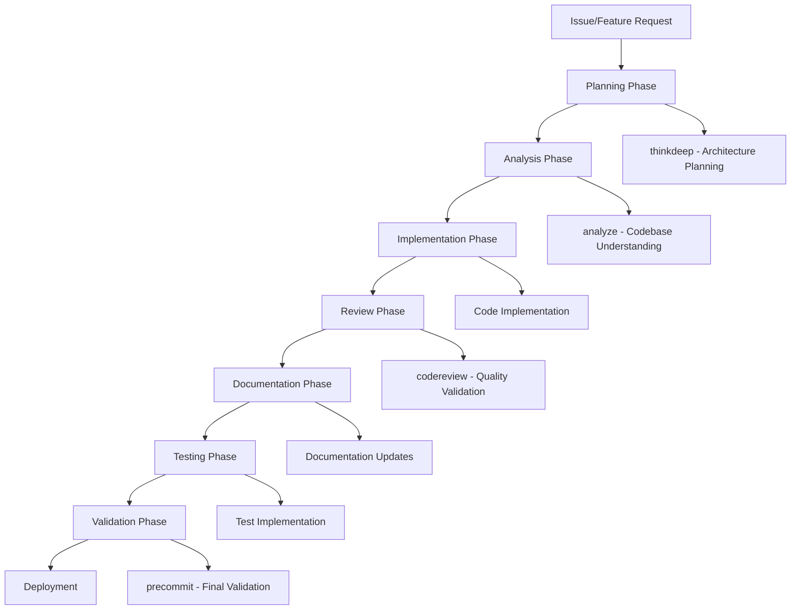

# Development Workflows & Processes

## Overview

This document outlines the development workflows and processes for the Gemini MCP Server project, following the collaboration patterns defined in CLAUDE.md and integrating with the Memory Bank system for context preservation.

## Core Development Workflow

### 1. Feature Development Process



### 2. Tool Selection Matrix Integration

**Planning Phase** - Use `thinkdeep`:
```json
{
  "name": "thinkdeep",
  "arguments": {
    "current_analysis": "Need to implement new tool for X functionality",
    "focus_areas": ["architecture", "integration", "security"],
    "thinking_mode": "high"
  }
}
```

**Analysis Phase** - Use `analyze`:
```json
{
  "name": "analyze", 
  "arguments": {
    "files": ["/workspace/tools/", "/workspace/utils/"],
    "question": "Understand existing tool architecture for new implementation",
    "analysis_type": "architecture"
  }
}
```

**Review Phase** - Use `codereview`:
```json
{
  "name": "codereview",
  "arguments": {
    "files": ["/workspace/new-feature/"],
    "context": "New tool implementation following established patterns",
    "review_type": "full"
  }
}
```

**Validation Phase** - Use `precommit`:
```json
{
  "name": "precommit",
  "arguments": {
    "path": "/workspace/",
    "original_request": "Implement new X tool with Y capabilities"
  }
}
```

## Memory Bank Integration Workflow

### Session Initialization

**Every development session must start with Memory Bank check**:

```bash
# 1. Check Memory Bank status
ls memory-bank/

# 2. Read current context
cat memory-bank/activeContext.md
cat memory-bank/progress.md  
cat memory-bank/decisionLog.md

# 3. Update current focus if needed
```

### Progress Tracking

**During development, update Memory Bank files**:

**activeContext.md** - Current work status:
```markdown
## Current Focus
[2025-01-11 23:30:00] - Implementing new debug tool feature for better error analysis
Working on: Enhanced stack trace parsing for multi-language support

## Recent Changes  
[2025-01-11 23:15:00] - Completed comprehensive documentation following CLAUDE.md structure
- docs/architecture/ completed (3 files)
- docs/api/ completed (MCP protocol + 6 tool APIs)
- Starting docs/contributing/ development workflow documentation
```

**progress.md** - Task completion tracking:
```markdown
## Current Tasks
- 🔄 Creating docs/contributing/ workflow documentation
- ✅ All tool API documentation completed
- 🔄 Planning next enhancement: multi-language debug support

## Completed Tasks  
- ✅ Comprehensive architecture documentation (overview, components, data-flow)
- ✅ Complete API documentation (MCP protocol + all 6 tools)
- ✅ Memory Bank integration with CLAUDE.md collaboration rules
```

**decisionLog.md** - Architectural decisions:
```markdown
[2025-01-11 23:30:00] - Tool Documentation Structure
Decision: Create individual API reference files for each tool rather than single comprehensive document
Rationale: Better maintainability, easier navigation, clearer separation of concerns
Implementation: docs/api/tools/ directory with dedicated files for chat, thinkdeep, analyze, codereview, debug, precommit
```

### UMB (Update Memory Bank) Protocol

**Manual synchronization command**: `Update Memory Bank` or `UMB`

**When to use UMB**:
- End of development session
- After major milestone completion
- Before switching between different features
- When context becomes fragmented

**UMB Process**:
1. Stop current activity
2. Review complete chat history
3. Update all Memory Bank files comprehensively
4. Ensure cross-session continuity
5. Document continuation points

## Git Workflow

### Branch Strategy

**Branch Naming Convention**:
```bash
feature/tool-enhancement-debug-multilang
feature/docs-api-reference
bugfix/security-path-validation
hotfix/memory-leak-conversation-storage
```

**Branch Lifecycle**:
```bash
# 1. Create feature branch
git checkout -b feature/new-functionality

# 2. Regular commits with descriptive messages
git add .
git commit -m "Implement core functionality for X feature

- Add new utility functions
- Update configuration handling  
- Add comprehensive tests
- Update documentation

🤖 Generated with Claude Code
Co-Authored-By: Claude <noreply@anthropic.com>"

# 3. Pre-merge validation
# Run precommit tool validation
# Update documentation
# Ensure Memory Bank is synchronized

# 4. Create pull request
gh pr create --title "Feature: New functionality" --body "..."
```

### Commit Message Standards

**Format Template**:
```
<type>: <description>

<body with detailed changes>

🤖 Generated with Claude Code
Co-Authored-By: Claude <noreply@anthropic.com>
```

**Commit Types**:
- `feat`: New feature implementation
- `fix`: Bug fixes and corrections
- `docs`: Documentation updates
- `refactor`: Code refactoring without functionality change
- `test`: Test additions or modifications
- `config`: Configuration and setup changes

### Pre-Commit Validation

**Mandatory validation before every commit**:

```bash
# 1. Run precommit tool
claude-code-cli --tool precommit --path $(pwd)

# 2. Address any critical/high issues
# 3. Update documentation if code changes
# 4. Ensure Memory Bank reflects changes
# 5. Commit only after validation passes
```

## Code Review Process

### Self-Review Checklist

**Before requesting review**:
- [ ] Run `codereview` tool on changes
- [ ] Address all critical and high-severity issues
- [ ] Update relevant documentation
- [ ] Add/update tests for new functionality
- [ ] Run full test suite locally
- [ ] Update Memory Bank with decisions made
- [ ] Ensure CLAUDE.md collaboration patterns followed

### Peer Review Process

**Review Preparation**:
```json
{
  "name": "analyze",
  "arguments": {
    "files": ["/workspace/changed-files/"],
    "question": "Prepare comprehensive context for code review",
    "analysis_type": "general"
  }
}
```

**Review Execution**:
```json
{
  "name": "codereview", 
  "arguments": {
    "files": ["/workspace/pull-request-files/"],
    "context": "Pull request review for [feature description]",
    "review_type": "full",
    "thinking_mode": "high"
  }
}
```

**Double Validation Protocol** (for critical changes):
1. **Primary Analysis** (Gemini): Deep code review using `codereview`
2. **Adversarial Review** (Claude): Challenge findings, look for edge cases
3. **Synthesis**: Combine insights and resolve disagreements
4. **Memory Update**: Record key decisions and validation results

## Documentation Workflow

### Documentation-Driven Development

**Every code change requires corresponding documentation updates**:

1. **Architecture Changes**: Update `docs/architecture/`
2. **API Changes**: Update `docs/api/` and tool references
3. **Process Changes**: Update `docs/contributing/`
4. **User-Facing Changes**: Update `docs/user-guides/`

### Documentation Quality Standards

**For Technical Audiences**:
- Include specific file and line number references (`file_path:line_number`)
- Explain architectural decisions and trade-offs
- Provide concrete examples and code snippets
- Document error scenarios and recovery strategies

**For Non-Technical Audiences**:
- Use plain language and explain technical terms
- Start with problem statements and value propositions
- Include practical usage scenarios
- Provide troubleshooting guides

### Documentation Review Process

```json
{
  "name": "analyze",
  "arguments": {
    "files": ["/workspace/docs/"],
    "question": "Review documentation completeness and accuracy against code changes",
    "analysis_type": "quality"
  }
}
```

## Testing Workflow

### Test Strategy

**Test Categories**:
1. **Unit Tests**: Individual tool functionality (`tests/test_tools.py`)
2. **Integration Tests**: Tool interaction and MCP protocol (`tests/test_integration.py`)
3. **Live Tests**: Real API integration (requires API keys)
4. **Security Tests**: Input validation and security scenarios

### Test Implementation Process

**Test-Driven Development**:
```bash
# 1. Write failing tests for new functionality
pytest tests/test_new_feature.py -v

# 2. Implement functionality to pass tests
# 3. Refactor while maintaining test coverage
# 4. Add additional edge case tests
# 5. Validate with full test suite
pytest tests/ -v --cov=tools --cov=utils
```

### Continuous Integration

**GitHub Actions Workflow**:
```yaml
name: Quality Assurance
on: [push, pull_request]

jobs:
  test:
    runs-on: ubuntu-latest
    steps:
      - uses: actions/checkout@v3
      - name: Setup Python
        uses: actions/setup-python@v4
        with:
          python-version: '3.9'
      - name: Install dependencies
        run: pip install -r requirements.txt
      - name: Run tests
        run: pytest tests/ -v --cov=tools --cov=utils
      - name: Run precommit validation
        run: claude-code-cli --tool precommit --path .
```

## Collaboration Patterns

### Claude & Gemini Workflow Integration

**Task Distribution**:
- **Claude**: Immediate tasks, coordination, file operations, git management
- **Gemini**: Deep analysis, strategic planning, comprehensive code review
- **Both**: Documentation creation, problem-solving, architecture decisions

**Communication Patterns**:
```json
// Claude initiates analysis
{
  "name": "analyze",
  "arguments": {
    "files": ["/workspace/complex-system/"],
    "question": "Understand system for major refactoring",
    "continuation_id": "analysis-session-uuid"
  }
}

// Gemini provides deep insights
// Claude uses insights for implementation decisions
// Both collaborate on documentation and validation
```

### Cross-Tool Continuation

**Maintain context across tool usage**:
```json
// 1. Initial exploration
{
  "name": "chat",
  "arguments": {
    "prompt": "How should we approach implementing caching?"
  }
}

// 2. Deep strategic analysis  
{
  "name": "thinkdeep",
  "arguments": {
    "current_analysis": "Initial caching discussion insights...",
    "continuation_id": "chat-session-uuid"
  }
}

// 3. Implementation analysis
{
  "name": "analyze", 
  "arguments": {
    "files": ["/workspace/"],
    "question": "Identify integration points for caching",
    "continuation_id": "strategy-session-uuid"
  }
}
```

## Release Workflow

### Automatic Versioning System

**Semantic versioning is automatically managed based on PR title prefixes**:

#### PR Title Conventions
- `feat:` - New features → **MINOR** version bump (0.X.0)
- `fix:` - Bug fixes → **PATCH** version bump (0.0.X)
- `breaking:` or `BREAKING CHANGE:` - Breaking changes → **MAJOR** version bump (X.0.0)
- `perf:` - Performance improvements → **PATCH** version bump
- `refactor:` - Code refactoring → **PATCH** version bump
- `docs:`, `chore:`, `test:`, `ci:`, `style:` - No version bump

#### Automatic Version Workflow
1. **Create PR with appropriate prefix**: `feat: Add new debugging capability`
2. **PR gets reviewed and merged to main**
3. **GitHub Action automatically**:
   - Detects version bump type from PR title
   - Updates version in `config.py`
   - Updates `__updated__` timestamp
   - Commits version change
   - Creates git tag (e.g., `v3.3.0`)
   - Generates GitHub release with PR description
   - Triggers Docker build workflow

#### Manual Version Bumping (if needed)
```bash
# Run the version bump script manually
python scripts/bump_version.py <major|minor|patch>

# Example: bump minor version
python scripts/bump_version.py minor
```

### Pre-Release Validation

**Comprehensive validation before release**:
```bash
# 1. Run full test suite
pytest tests/ -v --cov=tools --cov=utils

# 2. Security audit
claude-code-cli --tool codereview \
  --files /workspace/ \
  --context "Security audit for release" \
  --review-type security

# 3. Performance validation  
claude-code-cli --tool analyze \
  --files /workspace/ \
  --question "Identify performance issues for production" \
  --analysis-type performance

# 4. Documentation validation
claude-code-cli --tool analyze \
  --files /workspace/docs/ \
  --question "Validate documentation completeness and accuracy"

# 5. Final precommit validation
claude-code-cli --tool precommit --path /workspace/
```

### Release Documentation

**Automatic release notes are generated from PR descriptions**:
1. **GitHub Release**: Created automatically with PR details
2. **CHANGELOG.md**: Update manually for major releases
3. **README.md**: Update installation instructions if needed
4. **docs/**: Ensure documentation reflects new features

### Deployment Process

**Docker Image Workflow**:
```bash
# 1. Build and test image locally
docker build -t gemini-mcp-server:latest .
docker run --rm gemini-mcp-server:latest --version

# 2. Push to registry (automated via GitHub Actions)
# 3. Update deployment configurations
# 4. Monitor deployment health
```

## Troubleshooting Workflow

### Issue Investigation Process

**Systematic debugging approach**:
```json
{
  "name": "debug",
  "arguments": {
    "error_description": "Detailed problem description",
    "error_context": "Stack traces, logs, environment info",
    "files": ["/workspace/related-modules/"],
    "thinking_mode": "high"
  }
}
```

### Memory Bank for Issue Tracking

**Document issues and resolutions**:
```markdown
## decisionLog.md
[2025-01-11 23:45:00] - Memory Leak Resolution
Decision: Implement proper cleanup in conversation memory module
Rationale: Redis connections not properly closed, causing memory growth
Implementation: Added context managers and explicit cleanup in utils/conversation_memory.py:150
```

### Knowledge Base Maintenance

**Update Memory Bank with solutions**:
- Store successful debugging approaches
- Document common issues and resolutions  
- Maintain troubleshooting patterns
- Cross-reference with architectural decisions

---

This development workflow ensures high-quality, collaborative development while maintaining consistency with CLAUDE.md patterns and preserving knowledge through the Memory Bank system.