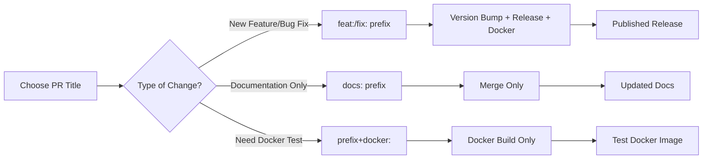

# Contributing Guide for Users

## Quick Start for Contributors

This guide helps new contributors understand how to contribute to the Gemini MCP Server project effectively.

## Pull Request Guidelines

### Understanding PR Title Automation

The project uses automated workflows based on your PR title. Choose the right prefix to get the appropriate automation:

#### 🚀 **For New Features & Bug Fixes** (creates releases):
```
feat: Add new chat streaming functionality
fix: Resolve memory leak in conversation history  
breaking: Remove deprecated tool parameters
perf: Optimize token usage calculation
refactor: Simplify error handling logic
```

**What happens:** Version bump + GitHub release + Docker image published

#### 📝 **For Documentation & Maintenance** (no releases):
```
docs: Update installation instructions
chore: Update dependencies
test: Add integration tests for analyze tool
ci: Improve workflow error handling
style: Fix code formatting issues
```

**What happens:** Changes merged, no automation triggered

#### 🐳 **For Testing Docker Changes** (Docker without releases):
```
docker: Test new Dockerfile optimization
docs+docker: Update Docker guide and test image
chore+docker: Update base image and test
test+docker: Add Docker integration tests
ci+docker: Update Docker workflow and test
style+docker: Fix Dockerfile formatting and test
```

**What happens:** Docker image built and published (tagged with PR number)

### Choosing the Right Prefix

**Ask yourself:**
1. **Does this add/change functionality?** → Use `feat:` or `fix:`
2. **Is this breaking existing behavior?** → Use `breaking:`
3. **Is this just documentation/maintenance?** → Use `docs:`, `chore:`, etc.
4. **Do I need to test Docker changes?** → Add `+docker` to any non-version prefix

### Examples by Change Type

#### Adding a New Tool
```
feat: Add sentiment analysis tool for code comments
```

#### Fixing a Bug
```
fix: Correct timeout handling in thinkdeep tool
```

#### Updating Documentation
```
docs: Add troubleshooting guide for Windows installation
```

#### Testing Docker Changes  
```
docs+docker: Update Docker configuration and test deployment
```

#### Major Breaking Changes
```
breaking: Change MCP protocol response format for better compatibility
```

## Docker Testing for Contributors

### When to Use Docker Build Combinations

**Use `+docker` suffix when:**
- You've modified Dockerfile, docker-compose.yml, or Docker-related configs
- You want to test the containerized version of your changes
- You're updating Docker documentation and want to verify it works
- You're making CI/CD changes that affect Docker builds

**Don't use `+docker` when:**
- Your changes don't affect containerization
- You're only updating code documentation
- You're making simple code style changes

### How Docker Testing Works

1. **PR Creation:** Docker build test runs automatically (no publishing)
2. **PR Merge with `+docker`:** Docker image built and pushed to GHCR
3. **Image Tags:** Your image will be tagged as:
   - `pr-{number}` (e.g., `pr-42`)
   - `main-{commit-sha}` (e.g., `main-abc1234`)

### Testing Your Docker Image

After your PR is merged with a `+docker` prefix:

```bash
# Pull your test image
docker pull ghcr.io/beehiveinnovations/zen-mcp-server:pr-42

# Or use the commit-based tag
docker pull ghcr.io/beehiveinnovations/zen-mcp-server:main-abc1234

# Test it locally
docker run -it --rm ghcr.io/beehiveinnovations/zen-mcp-server:pr-42
```

## Workflow Summary



## Best Practices

### Writing Good PR Titles
- **Be specific:** `feat: Add rate limiting to chat tool` not `feat: Update chat`
- **Use imperative mood:** `fix: Resolve timeout issue` not `fixes timeout issue`
- **Keep it concise:** Aim for 50 characters or less
- **Include scope when helpful:** `feat(precommit): Add Python syntax validation`

### Common Mistakes to Avoid
- ❌ `Update README` → ✅ `docs: Update installation requirements`
- ❌ `Fix bug` → ✅ `fix: Resolve memory leak in conversation threading`  
- ❌ `feat: Add feature` → ✅ `feat: Add multi-language support for code analysis`
- ❌ `docs: Update Docker and test it` → ✅ `docs+docker: Update container setup guide`

### Testing Your Changes

Before submitting a PR:

1. **Run local tests:**
   ```bash
   python -m pytest tests/ --ignore=tests/test_live_integration.py -v
   black --check .
   ruff check .
   ```

2. **Test Docker locally (if applicable):**
   ```bash
   docker build -t test-image .
   docker run -it --rm test-image
   ```

3. **Verify documentation builds:**
   - Check that any new documentation renders correctly
   - Ensure links work and examples are accurate

## Getting Help

- **Stuck on prefix choice?** Look at recent merged PRs for examples
- **Docker build failing?** Check the docker-test workflow results in your PR
- **Questions about automation?** Open a discussion or ask in your PR comments
- **Need API access for testing?** Live integration tests are optional for contributors

Remember: The automation is designed to help maintain consistency and quality. When in doubt, choose the most conservative prefix and ask for guidance in your PR!
